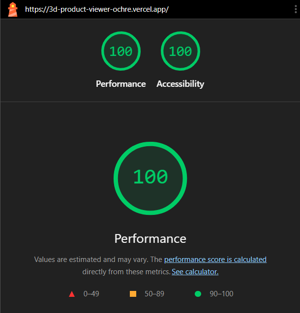

# FE-10 Accessibility & Performance Audit

## Project

**3D Product Viewer — Studio Headphones**

Preview: https://3d-product-viewer-ochre.vercel.app/

## Lighthouse — Mobile

| Audit         | Before |   After |   Delta |
| ------------- | -----: | ------: | ------: |
| Performance   |     85 | **100** | **+15** |
| Accessibility |     94 | **100** |  **+6** |

### Baseline

Initial Lighthouse mobile run:

* Performance: **85/100**
* Accessibility: **94/100**

The main performance bottleneck was the initial execution of the 3D viewer bundle. Lighthouse reported about **1.8 s** of JavaScript execution time, with the `ThreeScene` chunk responsible for most of the CPU and script-evaluation work.

### Final

Final Lighthouse mobile run after the optimization work:

* Performance: **100/100**
* Accessibility: **100/100**

The heavy 3D viewer is now deferred from the initial mobile page load and is activated explicitly by the user.

## Changes Made

### Performance

* Deferred the React Three Fiber / Three.js viewer until the user selects **Load 3D viewer** on mobile.
* Removed the previous one-second timer that still triggered the heavy 3D chunk during Lighthouse.
* Reduced the renderer device-pixel-ratio ceiling from `1.5` to `1.15`.
* Removed realtime canvas shadows to reduce rendering cost.
* Kept `frameloop="demand"` to avoid unnecessary continuous rendering.
* Added a React Three Fiber performance floor for constrained devices.

### Accessibility

* Added a native **Load 3D viewer** button that is reachable by keyboard.
* Added visible `:focus-visible` states for all interactive controls.
* Kept color selectors as native buttons with accessible labels and `aria-pressed` state.
* Kept the rotation control keyboard accessible with `aria-pressed` state.
* Added polite `role="status"` / `aria-live="polite"` feedback for 3D loading states.
* Improved secondary-text contrast from `#737373` to `#595959`.
* Preserved `prefers-reduced-motion` handling and disabled automatic rotation when reduced motion is requested.

## Keyboard Flow

The primary product configuration flow was tested using keyboard navigation only:

1. Tab to **Load 3D viewer**.
2. Activate it with Enter or Space.
3. Tab through the color controls.
4. Activate a color with Enter or Space.
5. Tab to the rotation control.
6. Toggle rotation with Enter or Space.
7. Confirm that a visible focus indicator is maintained throughout the flow.

The project does not currently contain a chat or streaming-output UI, so there is no chat stop button or streamed response to audit in this repository.

## WAVE Verification

WAVE audit completed on the deployed preview.

* Errors: **0**
* Contrast Errors: **0**
* Alerts: **0**
* AIM Score: **10/10**

No WAVE errors, contrast errors, or alerts were detected on the audited page.

## Audit Evidence

### Lighthouse Baseline

Baseline Lighthouse mobile scores:

* Performance: **85/100**
* Accessibility: **94/100**

The baseline run was used as the comparison point for the final audit results.

### Lighthouse Final

Final Lighthouse mobile scores:

* Performance: **100/100**
* Accessibility: **100/100**

## Final Result

| Requirement                         | Result             |
| ----------------------------------- | ------------------ |
| Lighthouse Mobile Performance 90+   | **PASS — 100/100** |
| Lighthouse Mobile Accessibility 90+ | **PASS — 100/100** |
| Performance optimization documented | **PASS**           |
| Accessibility changes documented    | **PASS**           |
| Keyboard flow tested                | **PASS**           |
| WAVE Errors                         | **PASS — 0**       |
| WAVE Contrast Errors                | **PASS — 0**       |
| WAVE Alerts                         | **PASS — 0**       |

## Conclusion

The implementation improved the Lighthouse mobile scores from **85/94** to **100/100**.

The largest performance gain came from preventing the heavy 3D rendering stack from loading during the initial mobile page load while keeping the full 3D viewer available on demand.

The final audit also achieved **0 WAVE errors, 0 contrast errors, 0 alerts, and a 10/10 AIM Score**, while the primary product configuration flow was verified using keyboard navigation only.
